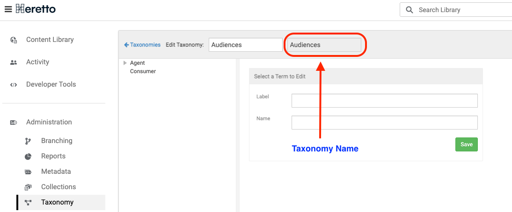

# Data Category Mapping Format {#r_data_category_mapping .reference}

The data category mapping connects Heretto taxonomy values to Salesforce data category groups, allowing taxonomy values from Heretto to be applied as Salesforce Knowledge data categories during publishing.

## Overview {#section_overview .section}

Salesforce Knowledge uses data categories to classify articles for visibility and filtering. The Syndication Service can automatically apply data category selections to each article it publishes, based on the taxonomy values assigned to that topic in Heretto CCMS.

The data category mapping tells the service which Heretto taxonomy corresponds to which Salesforce data category group. When a sync run processes an article, it reads the article's taxonomy values for the mapped groups and creates the corresponding `Knowledge__DataCategorySelection` records in Salesforce.

**Important:** Data category groups and their values must be created in Salesforce Setup before they can be used in a mapping. If a category group referenced in the mapping does not exist in Salesforce, category assignment for that group will be skipped for the affected articles.

## Format {#section_format .section}

The data category mapping is configured in the sync form as rows pairing a Heretto taxonomy name with a Salesforce data category group. Internally it is stored under the `category_map` key in the sync mapping JSON. Keys are Heretto taxonomy group names; values are the API names of the corresponding Salesforce data category groups.

**Important:**

The taxonomy name must be from the **Name** field in Heretto CCMS, not the **Label Name**. Taxonomy label names are in an editable field. Taxonomy Names are uneditable, shown in gray boxes, and defined on taxonomy creation.



Example:

```
{
  "category_map": {
    "Audiences": "Audiences",
    "Topics":    "Topics__c"
  }
}
```

In this example, topics tagged with values in the Heretto taxonomy named Audiences will have those values applied to the Salesforce data category group with API name Audiences. Topics tagged with values in the Heretto taxonomy Topics will have those values applied to the Salesforce group Topics\_\_c.

## Audience-specific content and Salesforce filtering {#section_audience_filtering .section}

If your Heretto content is tagged with audience values \(for example, private and public\), use data category mapping to control article visibility in Salesforce.

**Important:**

The Heretto to Salesforce syndication does not support DITA conditional processing. Content filtering for different audiences in Salesforce Knowledge should use taxonomy to data category mapping.

One reason is that Heretto CCMS assigns each topic a single UUID regardless of which audience sees it. If you were to run separate syncs filtered to different audiences using DITA conditional processing and DITAVals, both syncs would upsert to the same Salesforce Knowledge articles \(because the external ID field is the UUID\), and the most recently synced version would overwrite the previous one. You would not get separate articles per audience.

The correct approach is:

1.  Configure the sync with no audience filter so all content is returned from Deploy API.
2.  In Heretto, assign audience taxonomy values to each topic that needs them \(for example, a taxonomy named Audience with values such as Internal and External\).
3.  In Salesforce Setup, create a matching data category group and categories \(for example, a group named Audience with categories Internal and External\).
4.  In the sync form, add a Data Category Mapping row that maps the Heretto taxonomy Audience to the Salesforce category group Audience.

During each sync run, the service reads the audience taxonomy values from each topic and creates the corresponding `Knowledge__DataCategorySelection` records in Salesforce. Salesforce then handles article visibility and filtering based on those categories at query time.

**Important:** Taxonomy values are passed through to Salesforce unchanged. The value in your Heretto taxonomy must match the Salesforce data category API name exactly.

## Finding Salesforce data category group API names {#section_finding_api_names .section}

The Salesforce data category group API name is not always the same as the group's display label. To find the correct API name:

1.  In Salesforce, go to **Setup** \> **Data Category Setup**.
2.  Click the name of the data category group.
3.  The API name is shown in the group's detail view. Custom groups typically end in `__c`, which Salesforce automatically appends.

In the Syndication Service sync form, the Salesforce data category group dropdown is populated dynamically from your connected Salesforce organization, so you can select the group by label without needing to look up the API name manually.

